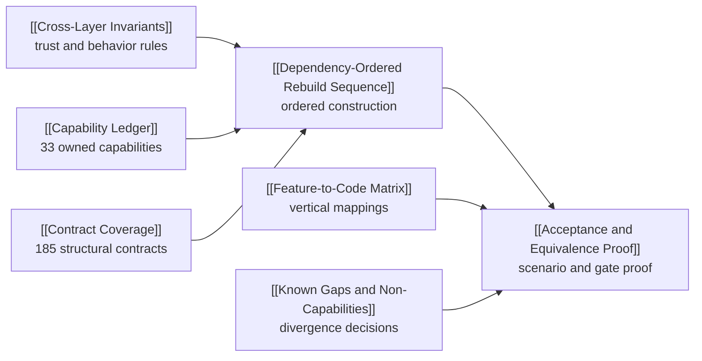

> [!info] Navigation
> Parent: [[INDEX]]. Sibling atlases: [[Feature Atlas]] · [[Technical Atlas]]. Rebuild leaves: [[Cross-Layer Invariants]] · [[Dependency-Ordered Rebuild Sequence]] · [[Acceptance and Equivalence Proof]].

# Rebuild Atlas

This atlas is the clean-room reconstruction contract for product snapshot `5448cf335e2cb25d74d6c0e6c476b72d1e14e803`. It preserves observable behavior and trust boundaries without requiring identical module names, and it keeps current defects, backend-only paths, dead code, prototypes, absences, and historical intent visibly distinct.

## Reading order

| Question | Owning note | Stop condition |
| --- | --- | --- |
| What may never be weakened across layers? | [[Cross-Layer Invariants]] | Every applicable `SQI-*` rule has named layers, failure behavior, qualification, owner, and proof |
| In what order can the system be reconstructed safely? | [[Dependency-Ordered Rebuild Sequence]] | Each stage has prerequisites, a vertical proof slice, and all three cross-cutting rails |
| What counts as equivalent, and which defects may be corrected? | [[Acceptance and Equivalence Proof]] | Happy path, failure, security, concurrency, recovery, and operations have executable and manual proof |
| What exactly belongs to the product contract? | [[Capability Ledger]] and [[Feature-to-Code Matrix]] | Every one of the 33 capability IDs is mapped once to its owner and implementation evidence |
| Is every structural interface owned? | [[Contract Coverage]] | All 185 current inventory IDs are classified once by semantic owner and rebuild stage |
| What must not be silently reproduced or invented? | [[Known Gaps and Non-Capabilities]] | Current defects, explicit absences, dead paths, and planned-only ideas have an explicit rebuild disposition |

## Rebuild policy

The contract has five evidence classes:

1. **Exact security and trust invariants** must be preserved or strengthened with proof. Scope, authorization, consent, encryption, lease fencing, rollback, and secret-handling behavior are never weakened for implementation convenience.
2. **User semantics** must remain observably equivalent: German labels and transitions matter where the feature leaves identify them as behavior. Internal decomposition may change.
3. **Observable defects** are reproduced only when compatibility explicitly requires them. A clean rebuild may correct one only when [[Known Gaps and Non-Capabilities]] and [[Acceptance and Equivalence Proof]] record the divergence and replacement proof.
4. **Backend-only, development-only, dead, and prototype behavior** remains classified with its current reachability. Structural existence is not permission to promote it to a user-facing capability.
5. **Absent and planned-only behavior** is excluded. In particular, Circles, generic undo, integrated PDF work, real form output, and unlisted administration surfaces do not enter the rebuild scope.

The four status axes in [[Truth and Status Model]] remain independent. `partial` does not mean optional, `backend-only` does not mean absent, `source-only` does not mean proven at runtime, and `planned-only` does not mean queued for implementation.

## Change-together rails

Every rebuild stage is crossed by three non-negotiable rails:

- **Persistence rail:** each conceptual model joins its migration, complete lifecycle, dialect behavior, and proof. A table is not complete when only current ORM creation works.
- **Contract rail:** each `/api/*` method joins executable authorization/gates, route-policy bijection, adversarial coverage, OpenAPI, the client adapter/consumer or an explicit `backend-only` classification, and stable error behavior.
- **Trust and operations rail:** security, privacy, observability, failure recovery, and acceptance proof span every stage rather than arriving after feature construction.

## Source and exclusion boundary

Executable code, tests, migrations, configuration, and generated contracts outrank this handbook. The exact inventory set is owned by [[Contract Coverage]], while semantic ownership comes from finished feature and technical notes rather than generated prose. No root environment values, credentials, private documents, prompt secrets, or private golden material belong here. [[Historical Plans Usage Boundary]] contains the only permitted use of planned intent and keeps it outside equivalence.
