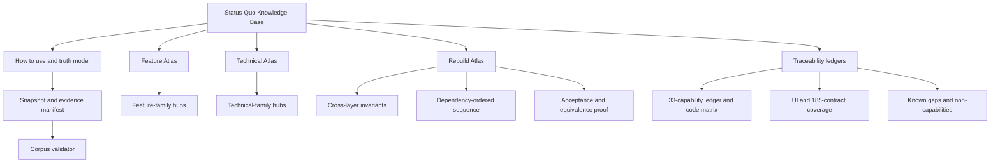

> [!info] Navigation
> Parent: none (corpus root). Top-level atlases: [[Feature Atlas]] · [[Technical Atlas]] · [[Rebuild Atlas]].

# Status-Quo Knowledge Base

> [!warning] Frozen product snapshot
> This corpus describes product behavior at commit `5448cf335e2cb25d74d6c0e6c476b72d1e14e803`. Later documentation commits may improve the explanation, but they do not change the product snapshot. Re-verify against executable evidence before applying a claim to another revision.

Choose the shortest path that answers the question.

| Reader goal | Start here | What it provides |
| --- | --- | --- |
| Discover current product behavior | [[Feature Atlas]] | Complete feature-family navigation, user-visible behavior, limitations, and proof |
| Understand implementation | [[Technical Atlas]] | Technical-family navigation toward boundaries, state, contracts, and proof |
| Plan a clean-room rebuild | [[Rebuild Atlas]] | The entry point for invariants, dependency order, and equivalence proof |
| Audit coverage and evidence | [[Snapshot and Evidence Manifest]] | Snapshot scope, authority order, inventory counts, and validator commands |
| Trace a capability, UI surface, contract, or gap | [[Capability Ledger]] | Exact ledgers for 33 capabilities, UI reachability, 185 inventory contracts, code ownership, and negative space |

## Entry guides

- [[How to Use This Knowledge Base]] — citation rules and reusable note templates.
- [[Truth and Status Model]] — authority order and the four independent status axes.
- [[Reading Paths for Humans and Agents]] — short routes for discovery, implementation, rebuilding, and auditing.
- [[Snapshot and Evidence Manifest]] — frozen revision, evidence sources, coverage baseline, and validation commands.

## Top-level atlases

- [[Feature Atlas]] — begin with what the product does, exposes, or intentionally does not do.
- [[Technical Atlas]] — begin with system structure, contracts, state, and operational behavior.
- [[Rebuild Atlas]] — begin with [[Cross-Layer Invariants]], then follow [[Dependency-Ordered Rebuild Sequence]] and close with [[Acceptance and Equivalence Proof]].

## Traceability ledgers

- [[Capability Ledger]] — the exact 33-capability delivery, reachability, persistence, evidence and proof register.
- [[UI Surface Coverage]] — all twelve destinations, auth/token/global surfaces, reusable controls, caches and unreachable/backend-only UI boundaries.
- [[Contract Coverage]] — every one of the 185 current inventory IDs with semantic ownership and rebuild relevance.
- [[Feature-to-Code Matrix]] — capability-to-client/API/domain/job/schema/test/Map ownership.
- [[Known Gaps and Non-Capabilities]] — verified defects, proof gaps, backend-only boundaries and explicitly excluded scope.
