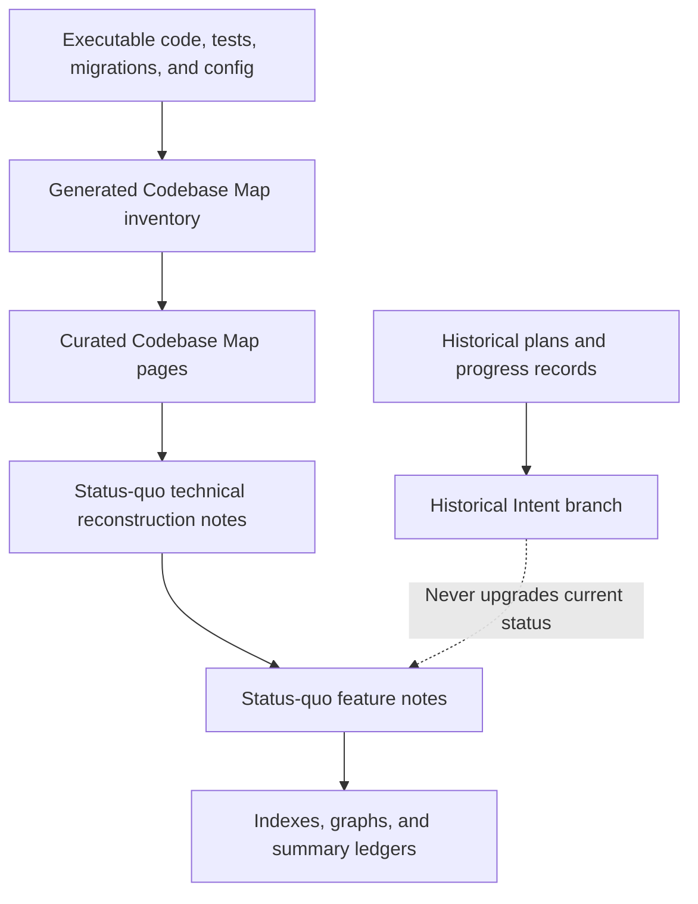
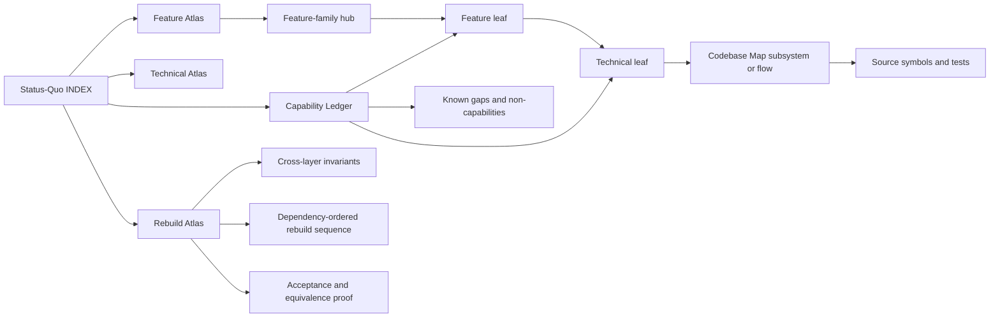
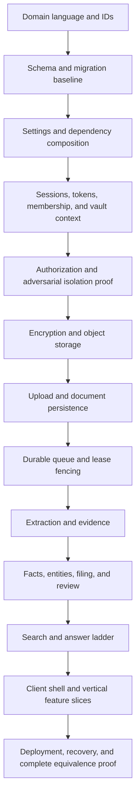

# docs7 Status-Quo Knowledge Base Design

**Status:** Approved for planning
**Approved direction:** Integrated feature and technical atlas
**Snapshot base:** `5448cf335e2cb25d74d6c0e6c476b72d1e14e803`
**Verification date:** 2026-07-30

## Objective

Create a reconstruction-grade, progressively disclosed knowledge base that lets
a human or an agent:

1. discover every current docs7 capability and sub-capability;
2. understand exact user behavior, controls, states, permissions, failure
   handling, and limitations;
3. trace that behavior into current client, API, domain, persistence, job,
   infrastructure, configuration, migration, and test evidence;
4. rebuild an equivalent system without loading the whole repository into
   context; and
5. distinguish implemented behavior from prototypes, dead code, absent
   capabilities, and historical intent.

This is not a marketing description. It is a faithful snapshot of executable
behavior, including defects and inconsistencies that materially affect
equivalence.

## Design choice

The new corpus lives under `docs/status-quo/`, but it does not replace or clone
the existing Codebase Map.

- `docs/status-quo/` owns feature behavior, reconstruction explanations,
  status boundaries, coverage ledgers, and rebuild guidance.
- `docs/map/` remains the canonical context-efficient router to current source,
  generated route/model/job/client inventory, subsystem ownership, and
  cross-cutting flows.
- Existing Map claims found to conflict with executable code are corrected in
  the same change.
- Historical plans remain historical evidence. Planned-only capabilities are
  summarized in a quarantined branch and never mixed into the current rebuild
  contract.

This integrated approach avoids a second competing code map while giving the
status-quo corpus enough technical detail to stand on its own as a rebuild
specification.

## Truth hierarchy



When two layers disagree, the higher layer in this hierarchy is corrected to
match the lower, more authoritative layer. Historical records may explain
intent but cannot establish current functionality.

## Capability status model

Every capability uses four independent status axes.

### Delivery

- `implemented` — the behavior is present through its required layers.
- `partial` — a reachable workflow exists, but the represented outcome or an
  essential recovery path is incomplete.
- `prototype` — demonstrative or mock behavior exists without the represented
  durable/product outcome.
- `planned-only` — described in historical design material but absent from the
  current executable system.
- `absent` — explicitly checked and not found.

### Reachability

- `user-facing`
- `development-only`
- `backend-only`
- `dead-or-unreachable`
- `not-applicable`

### Persistence

- `durable`
- `session-memory`
- `ephemeral`
- `none`

### Evidence confidence

- `runtime-code-tests`
- `code-and-tests`
- `source-only`
- `historical-only`

These axes prevent misleading labels. For example, the Forms experience is
`prototype + user-facing + session-memory + source-only`, whereas direct entity
merge is `implemented + backend-only + durable + code-and-tests`.

## Information architecture

```text
docs/status-quo/
├── INDEX.md
├── 00-guides/
│   ├── How to Use This Knowledge Base.md
│   ├── Truth and Status Model.md
│   ├── Reading Paths for Humans and Agents.md
│   └── Snapshot and Evidence Manifest.md
├── 10-features/
│   ├── Feature Atlas.md
│   ├── Account and Access/
│   ├── Shell and Navigation/
│   ├── Capture and Processing/
│   ├── Documents and Knowledge/
│   ├── Facts Entities and Review/
│   ├── Assistant and Search/
│   ├── Forms/
│   ├── Dashboards and Reporting/
│   └── Historical Intent/
├── 20-technical/
│   ├── Technical Atlas.md
│   ├── System Architecture/
│   ├── Client Architecture/
│   ├── Backend and API/
│   ├── Data and Migrations/
│   ├── Jobs and AI/
│   ├── Security and Storage/
│   └── Runtime and Operations/
├── 30-rebuild/
│   ├── Rebuild Atlas.md
│   ├── Cross-Layer Invariants.md
│   ├── Dependency-Ordered Rebuild Sequence.md
│   └── Acceptance and Equivalence Proof.md
└── 40-traceability/
    ├── Capability Ledger.md
    ├── UI Surface Coverage.md
    ├── Contract Coverage.md
    ├── Feature-to-Code Matrix.md
    └── Known Gaps and Non-Capabilities.md
```

Folder names provide predictable browsing order. Note names remain descriptive
and unique so the Obsidian graph is readable without path labels.

## Navigation model



The corpus supports three primary read paths:

1. **Human product discovery:** `INDEX` → Feature Atlas → family hub → feature
   leaf → sub-feature detail.
2. **Agent implementation discovery:** `INDEX` → Capability Ledger → feature
   leaf → technical leaf → Codebase Map → exact source and tests.
3. **Clean-room rebuild:** `INDEX` → Rebuild Atlas → invariants → dependency
   sequence → feature/technical leaves → equivalence proof.

No index carries detailed implementation prose. It contains summaries and
links only.

## Obsidian note contract

Every note uses YAML frontmatter and Obsidian wikilinks.

Common properties:

```yaml
---
id: stable-kebab-case-id
title: Human-readable unique title
kind: guide
status: current
snapshot_commit: 5448cf335e2cb25d74d6c0e6c476b72d1e14e803
last_verified: 2026-07-30
tags:
  - status-quo/guide
parent: "[[INDEX]]"
related:
  - "[[Feature Atlas]]"
---
```

Feature notes additionally carry `capability_ids`, `delivery`,
`reachability`, `persistence`, and `evidence`.

Technical notes additionally carry `map_pages`, `inventory_refs`, and
`feature_links`.

Every note begins with explicit parent and sibling navigation, then ends with
related-feature, related-technical, Map, and source-evidence links. Graph edges
are therefore bidirectional at the semantic level rather than incidental.

## Feature-note contract

Each feature leaf answers:

1. What promise does the feature make?
2. Is it current, partial, prototype, planned, dead, or absent?
3. Who can reach it and through which navigation or endpoint?
4. What preconditions and permission gates apply?
5. What controls are visible, including every meaningful button, input,
   selector, drawer, dialog, and link?
6. What does each control do?
7. What are the state transitions?
8. What is persisted, where, and for how long?
9. What loading, empty, success, retry, stale, and terminal failure states
   exist?
10. What mouse, keyboard, responsive, focus, and accessibility behavior exists?
11. Which APIs, jobs, models, and client state owners support the behavior?
12. What privacy and trust boundaries apply?
13. Which limitations, contradictions, and missing affordances are materially
    observable?
14. What behavior must an equivalent rebuild preserve?
15. Which exact symbols and tests prove each claim?

Control-heavy views use tables with:

| Control | Visible when | Input | Action | Result | Persistence | Failure behavior |
| --- | --- | --- | --- | --- | --- | --- |

Complex state uses Mermaid state diagrams rather than paragraphs alone.

## Technical-note contract

Each technical leaf explains:

1. responsibility and module boundary;
2. public and internal entry points;
3. exact source symbols;
4. dependency direction and composition;
5. owned models and stored state;
6. request, transaction, or job control flow;
7. authorization, vault scope, consent, and cryptographic boundaries;
8. idempotency, concurrency, lease, and rollback behavior;
9. configuration names and semantics without secret values;
10. failure, degradation, recovery, and observability;
11. database-dialect or deployment differences;
12. tests and operational proof;
13. known drift and limitations; and
14. the rebuild ordering and invariants that depend on it.

Technical notes reference symbols rather than line numbers.

## Planned feature decomposition

The feature atlas covers at least these families and leaves.

### Account and access

- login, signup, logout, and development auto-login;
- email verification and token-link handling;
- password reset request and confirmation;
- verification recovery banner;
- AI consent grant, recovery, and backend-only withdrawal;
- backend-only account export and deletion;
- role and vault limitations.

### Shell and navigation

- desktop sidebar and mobile tab bar;
- hash routing and browser history;
- top-bar controls and badges;
- global summary loading;
- toasts;
- global document drawer;
- global review inbox;
- development reset.

### Capture and processing

- drag/drop, native file picker, and camera picker;
- accepted file boundary and client/backend mismatch;
- optional filing context;
- bundled sample enumeration and import;
- verified-email and consent gates;
- encrypted upload;
- polling, cosmetic versus real stages, timeout, recheck, retry, and filing
  dead-letter recovery;
- capture result and navigation.

### Documents and knowledge

- document library, folder rail, loaded-page search, sorting, and pagination;
- document detail drawer and original-file behavior;
- summary, action, amounts, dates, facts, trust flags, tags, and language toggle;
- task and deadline projections;
- database table and value tabs;
- dead facts tab;
- fact wallet, normalization, copy, source opening, and verification;
- family/person surfaces;
- insights and derived calculations;
- activity feed with explicit no-undo boundary.

### Entities and review

- entity register and filters;
- manual entity creation, aliases, and identifiers;
- entity cards and confirmation;
- manual and extracted facts;
- linked documents;
- unlink and reassignment;
- merge and unmerge as backend-only capabilities;
- identity, conflict, and unfiled review;
- nightly deterministic and semantic audit behavior.

### Assistant and search

- persisted message loading;
- pending/progress polling;
- consent recovery;
- question submission;
- four-rung answer ladder;
- fixed read-only tools;
- transcript search;
- selected-original-page inspection;
- citation guarding and its evidence limitation;
- insufficient and failure outcomes;
- missing conversation memory and management features.

### Forms and PDF boundary

- four hardcoded form templates;
- fact resolution and name derivation;
- timed autofill cascade;
- manual, suggested, confirmed, rejected, reset, and confirm-all states;
- provenance links;
- mock export and success screen;
- absence of generated/modified PDF, AcroForm support, signatures, annotations,
  highlights, or integrated page rendering.

### Historical intent

- Circles as planned sharing/visibility behavior;
- planned capabilities discovered in other historical records only when they are
  important enough to prevent loss;
- a mandatory warning on every historical note that it is not part of the
  current rebuild contract.

## Planned technical decomposition

The technical atlas covers:

- system topology and dependency composition;
- client shell, state ownership, API adapter, document cache, and polling;
- backend router/domain/infrastructure boundaries;
- the complete current API and error contract;
- authentication, opaque database-backed sessions, tokens, context, roles, and
  vault scoping;
- the 32-model domain catalog and relationships;
- the 11-revision linear migration history and SQLite/PostgreSQL differences;
- file validation, quotas, temporary streaming, encryption, local/S3 storage,
  serving, and erasure;
- durable job state, claim, lease fencing, retry, dead-letter, chaining,
  per-vault serialization, inline mode, and worker mode;
- extraction envelopes, evidence persistence, actual provenance depth, seed and
  Vertex behavior, and provider fallback;
- filing, entity identity, facts, revisions, review, and auditor automation;
- transcript search, answer tools, selected-original inspection, and citations;
- account export, deletion, and development reset;
- runtime settings, startup, deployment, readiness, backup, restore, and key
  rotation;
- observability, audit behavior, incident recovery, and operational gaps;
- testing lanes, release gates, and private-proof boundaries.

## Required graphs

Graphs are used only where they materially reduce reading effort.

1. Knowledge-base navigation and evidence hierarchy.
2. Feature-family dependency graph.
3. Authentication-to-vault-context flow.
4. Client shell, state ownership, cache, and navigation graph.
5. Capture state machine.
6. Upload → encryption → job → extraction → filing → polling flow.
7. Processing-job lease/retry/dead-letter state machine.
8. Extraction/evidence/provenance relationship graph.
9. Entity/fact/revision/constraint/review relationship graph.
10. Entity merge/unmerge and unlink/reassign state transitions.
11. Assistant four-rung answer ladder and citation boundary.
12. Nightly auditor scheduling and policy-limited action flow.
13. Encryption key hierarchy and file lifecycle.
14. Runtime/deployment topology.
15. Account export/deletion/reset lifecycle comparison.
16. Dependency-ordered rebuild graph.

All diagrams use quoted Mermaid node labels when punctuation is present and
remain understandable from the surrounding prose.

## Traceability and completeness

The snapshot currently contains:

- 12 reachable main client destinations;
- 39 development API routes and 38 production API routes;
- 31 generated client API methods;
- 32 ORM models;
- 5 job handlers;
- 11 migrations; and
- 63 generated backend test-file inventory entries.

The ledgers must account for every item in these sets.

### Capability Ledger

One row per stable capability ID:

| ID | Capability | Delivery | Reachability | Feature note | Technical notes | Evidence |
| --- | --- | --- | --- | --- | --- | --- |

### UI Surface Coverage

Accounts for every:

- reachable view;
- auth/token screen;
- shared drawer and dialog;
- reusable feature component;
- meaningful control group;
- dead or unreachable component; and
- backend capability lacking a UI.

### Contract Coverage

Accounts for every generated:

- API route;
- client method;
- job handler;
- model;
- migration; and
- classified inventory unknown.

### Feature-to-Code Matrix

Maps each capability ID to:

- client view/component/helper;
- API adapter method;
- route handler;
- domain symbol;
- job handler;
- model/migration;
- focused test; and
- Codebase Map page.

### Known Gaps and Non-Capabilities

Explicitly records:

- undo is absent;
- Circles is planned-only;
- forms are a client-only prototype and do not create PDFs;
- annotations and drawing are absent;
- PDF editing, signatures, and integrated page viewing are absent;
- backend-only features;
- dead/unreachable code;
- presentation claims not verified by runtime state;
- Codebase Map drift;
- contract inconsistencies and known recovery gaps.

## Verified corrections that affect documentation

The change must correct or clearly qualify these already verified claims:

- sessions use opaque random secrets whose hashes are stored in the database;
  they are not signed self-contained cookies;
- inline-only execution does not reap abandoned running leases or schedule its
  own future retry wake-up;
- `ProcessingJob.priority` is persisted but ignored by claim ordering;
- S3-backed file rows retain the default `storage_provider=local`;
- stored plaintext SHA-256 is not checked during reads;
- readiness verifies only a database query, not migration head, storage, SMTP,
  AI credentials, or decryptability;
- route policy is tested metadata, not centralized runtime authorization
  middleware;
- SQLite does not enable foreign-key enforcement;
- normal extraction provenance is shallower than the schema permits;
- the account export omits several operational and provenance tables;
- the runtime sample-import response can be 202 while committed OpenAPI
  describes only 200;
- chat is durable but does not use prior conversation history to answer the
  next question;
- citations are vault/person guarded but not proved to support the answer;
- several UI error and accessibility paths are incomplete.

These are status-quo facts, not scope for product repair in this documentation
change.

## Error and uncertainty handling

Documentation uncertainty is never hidden in fluent prose.

- Conflicting evidence is recorded in `Known Gaps and Non-Capabilities`.
- A claim without test proof uses `source-only` confidence.
- Historical-only evidence cannot yield `implemented`.
- Runtime verification that cannot be performed is named in the evidence
  manifest.
- A code path that exists but lacks normal navigation is labeled
  `dead-or-unreachable`.
- UI presentation language is described separately from the actual persisted
  outcome.
- Known bugs are documented as observed behavior and separately marked as
  unsuitable defaults for a clean rebuild.

## Rebuild guidance

The rebuild atlas organizes work by dependency and invariant rather than by
the current repository’s file order.



Each rebuild stage links to:

- required invariants;
- feature and technical notes;
- contracts it introduces;
- data it owns;
- tests that prove equivalence; and
- known current defects that should be consciously retained or corrected.

## Verification strategy

### Structural checks

- Resolve every Obsidian wikilink to exactly one note.
- Resolve every local Markdown link.
- Check every note for required frontmatter properties.
- Check capability IDs for uniqueness.
- Check bidirectional parent/child and feature/technical relationships.
- Compare contract ledgers with the committed generated inventories.
- Compare UI coverage with current client views/components and navigation.
- Scan the corpus for ambiguous placeholders and accidental claims that
  planned-only features are current.

### Repository checks

- regenerate the deterministic inventory;
- review Codebase Map impact;
- update or attest every impacted curated Map page;
- run Codebase Map maintenance and merge-blocking checks;
- run the bounded narrative audit;
- run client tests and build;
- run backend SQLite tests;
- run backend PostgreSQL tests when the configured database lane is available;
- run Ruff checks;
- check committed OpenAPI;
- perform a local runtime smoke and representative browser walkthrough.

The private golden backtest remains private and is not copied into the corpus.

### Independent review

After focused proof:

1. run the repository AutoReview workflow;
2. reproduce every actionable finding;
3. repair verified documentation defects;
4. rerun affected structural and repository proof; and
5. report accepted and rejected review findings with exact evidence.

## Acceptance criteria

The corpus is complete only when:

1. a new reader can name every reachable product surface and its sub-features
   from the Feature Atlas;
2. every meaningful control has documented visibility, action, result,
   persistence, and failure behavior;
3. the 39 routes, 31 client methods, 32 models, 5 jobs, and 11 migrations are
   each represented in the traceability layer;
4. every feature leaf reaches exact source symbols and proof without broad
   repository reading;
5. every technical leaf links back to the user behavior it supports;
6. implemented, prototype, dead, absent, and planned-only behavior cannot be
   confused;
7. all required Mermaid diagrams render syntactically;
8. every internal link resolves;
9. verified Codebase Map drift is reconciled;
10. repository checks pass or unavailable external lanes are reported
    precisely; and
11. an independent reviewer finds no material capability, contract, or
    reconstruction gap.

## Security and privacy constraints

- Never open, print, summarize, or copy root `.env` contents.
- Never include credentials, raw transcripts, private documents, plaintext
  keys, sensitive prompt content, private golden corpus data, or golden output.
- Configuration documentation names variables and semantics only.
- Fixture filenames and synthetic behavior may be described without embedding
  private or raw document content.
- Technical detail must preserve the session-derived identity, membership-
  derived scope, consent, encryption, and erasure trust boundaries.

## Deliverable boundary

This change documents current behavior and reconciles stale documentation. It
does not implement missing product features or silently repair discovered
product defects. Those items remain explicit inputs to the future rebuild.
